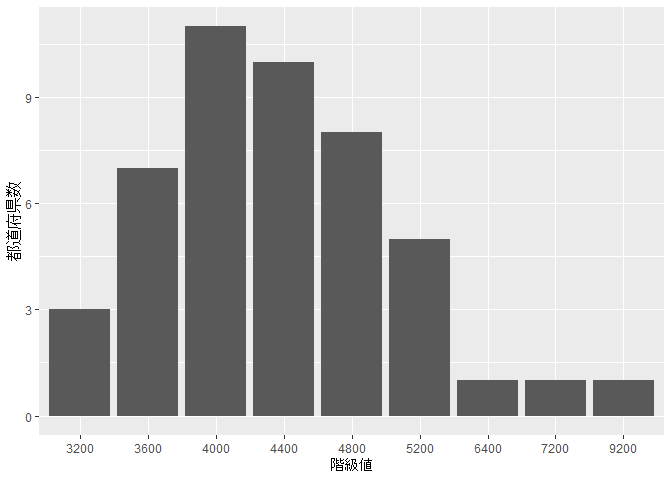
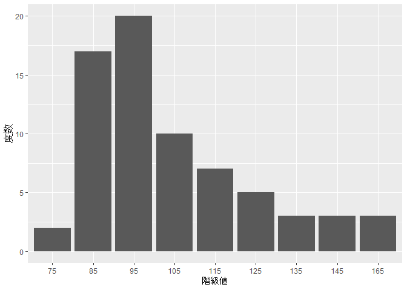
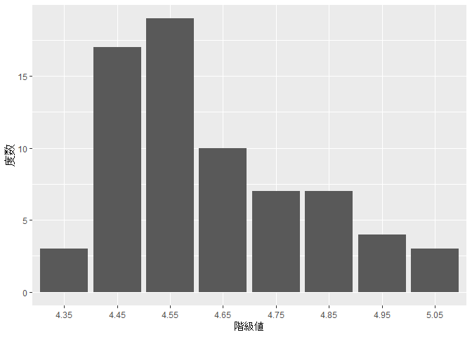

入門統計解析
================

## 概要

[入門統計解析
(新世社)](https://www.saiensu.co.jp/search/?isbn=978-4-88384-140-0&y=2009)
演習問題の R による解答例です。

-   解答は間違っているかもしれません。
-   できるだけ tidyverse 圏で頑張りました:

``` r
library(tidyverse)
```

-   [公式のサポートページ](https://www.saiensu.co.jp/search/?isbn=978-4-88384-140-0&y=2009#support)
    よりダウンロードしたデータソースを利用しています:

``` r
if (!xfun::file_exists("data/data.xlsx")) {
  curl::curl_download(
    "https://www.saiensu.co.jp/book_support/978-4-88384-140-0/data.xlsx",
    "data/data.xlsx"
  )
}
```

## 問題 2.1

### 1

最小階級の下限を `700` 円、最大階級の上限を `3500` 円とし、階級幅を
`400` とする:

``` r
階級境界 <- seq(from = 700, to = 3500, by = 400)
階級下限 <- 階級境界[-length(階級境界)]
階級上限 <- 階級境界[-1]
階級名 <- str_c(階級下限, 階級上限, sep = " ～ ")
階級値 <- (階級下限 + 階級上限) / 2
```

度数分布表は:

``` r
表2.1 <- readxl::read_excel("data/data.xlsx",
                               sheet = "表2.1",
                               range = "A2:C49")
度数分布表 <- 表2.1 %>% 
  group_by(
    階級   = cut(`家賃(円）`, breaks = 階級境界, right = FALSE, labels = 階級名),
    階級値 = cut(`家賃(円）`, breaks = 階級境界, right = FALSE, labels = 階級値),
  ) %>% 
  summarise(度数 = n(), .groups = "drop") %>% 
  mutate(
    累積度数     = cumsum(度数),
    相対度数     = 度数 / sum(度数),
    累積相対度数 = cumsum(相対度数),
  )
度数分布表
```

<div class="kable-table">

| 階級         | 階級値 | 度数 | 累積度数 |  相対度数 | 累積相対度数 |
|:-------------|:-------|-----:|---------:|----------:|-------------:|
| 700 ～ 1100  | 900    |   16 |       16 | 0.3404255 |    0.3404255 |
| 1100 ～ 1500 | 1300   |   19 |       35 | 0.4042553 |    0.7446809 |
| 1500 ～ 1900 | 1700   |    2 |       37 | 0.0425532 |    0.7872340 |
| 1900 ～ 2300 | 2100   |    5 |       42 | 0.1063830 |    0.8936170 |
| 2300 ～ 2700 | 2500   |    2 |       44 | 0.0425532 |    0.9361702 |
| 2700 ～ 3100 | 2900   |    1 |       45 | 0.0212766 |    0.9574468 |
| 3100 ～ 3500 | 3300   |    2 |       47 | 0.0425532 |    1.0000000 |

</div>

したがって、モードは:

``` r
モード <- 度数分布表 %>% slice_max(度数) %>% pull(階級値) %>% as.character() %>% as.integer()
モード
```

    [1] 1300

### 2

最小階級の下限を `3000` 円、最大階級の上限を `9400` 円、階級幅を `400`
とて度数分布表を作ると:

``` r
階級境界 <- seq(from = 3000, to = 9400, by = 400)
階級下限 <- 階級境界[-length(階級境界)]
階級上限 <- 階級境界[-1]
階級名 <- str_c(階級下限, 階級上限, sep = " ～ ")
階級値 <- (階級下限 + 階級上限) / 2
表2.4 <- readxl::read_excel("data/data.xlsx",
                               sheet = "表2.4, 表2.5, 表2.6",
                               range = "A2:D49")
度数分布表 <- 表2.4 %>% 
  group_by(
    階級   = cut(`家賃（民営, 2005年)`, breaks = 階級境界, right = FALSE, labels = 階級名),
    階級値 = cut(`家賃（民営, 2005年)`, breaks = 階級境界, right = FALSE, labels = 階級値),
  ) %>% 
  summarise(度数 = n(), .groups = "drop") %>% 
  mutate(
    累積度数     = cumsum(度数),
    相対度数     = 度数 / sum(度数),
    累積相対度数 = cumsum(相対度数),
  )
度数分布表
```

<div class="kable-table">

| 階級         | 階級値 | 度数 | 累積度数 |  相対度数 | 累積相対度数 |
|:-------------|:-------|-----:|---------:|----------:|-------------:|
| 3000 ～ 3400 | 3200   |    3 |        3 | 0.0638298 |    0.0638298 |
| 3400 ～ 3800 | 3600   |    7 |       10 | 0.1489362 |    0.2127660 |
| 3800 ～ 4200 | 4000   |   11 |       21 | 0.2340426 |    0.4468085 |
| 4200 ～ 4600 | 4400   |   10 |       31 | 0.2127660 |    0.6595745 |
| 4600 ～ 5000 | 4800   |    8 |       39 | 0.1702128 |    0.8297872 |
| 5000 ～ 5400 | 5200   |    5 |       44 | 0.1063830 |    0.9361702 |
| 6200 ～ 6600 | 6400   |    1 |       45 | 0.0212766 |    0.9574468 |
| 7000 ～ 7400 | 7200   |    1 |       46 | 0.0212766 |    0.9787234 |
| 9000 ～ 9400 | 9200   |    1 |       47 | 0.0212766 |    1.0000000 |

</div>

モードは:

``` r
モード <- 度数分布表 %>% slice_max(度数) %>% pull(階級値) %>% as.character() %>% as.integer()
モード
```

    [1] 4000

ヒストグラムにすると:

``` r
ggplot(data = 度数分布表, mapping = aes(x = 階級値, y = 度数)) +
  geom_col() +
  labs(y = "都道府県数")
```



考察: あとでやる。

### 3

あきたので省略。

### 4

あきたので (ry

### 5

#### (1)

度数分布表:

``` r
表2.6_前半 <- readxl::read_excel("data/data.xlsx",
                               sheet = "表2.4, 表2.5, 表2.6",
                               range = "I2:J52")
表2.6_後半 <- readxl::read_excel("data/data.xlsx",
                               sheet = "表2.4, 表2.5, 表2.6",
                               range = "L2:M22")
表2.6 <- bind_rows(表2.6_前半, 表2.6_後半)
階級境界 <- seq(from = 70, to = 170, by = 10)
階級下限 <- 階級境界[-length(階級境界)]
階級上限 <- 階級境界[-1]
階級名 <- str_c(階級下限, 階級上限, sep = " ～ ")
階級値 <- (階級下限 + 階級上限) / 2
度数分布表 <- 表2.6 %>% 
  group_by(
    階級   = cut(`血糖値 (mg/dL)`, breaks = 階級境界, right = FALSE, labels = 階級名),
    階級値 = cut(`血糖値 (mg/dL)`, breaks = 階級境界, right = FALSE, labels = 階級値),
  ) %>% 
  summarise(度数 = n(), .groups = "drop") %>% 
  mutate(
    累積度数     = cumsum(度数),
    相対度数     = 度数 / sum(度数),
    累積相対度数 = cumsum(相対度数),
  )
度数分布表
```

<div class="kable-table">

| 階級       | 階級値 | 度数 | 累積度数 |  相対度数 | 累積相対度数 |
|:-----------|:-------|-----:|---------:|----------:|-------------:|
| 70 ～ 80   | 75     |    2 |        2 | 0.0285714 |    0.0285714 |
| 80 ～ 90   | 85     |   17 |       19 | 0.2428571 |    0.2714286 |
| 90 ～ 100  | 95     |   20 |       39 | 0.2857143 |    0.5571429 |
| 100 ～ 110 | 105    |   10 |       49 | 0.1428571 |    0.7000000 |
| 110 ～ 120 | 115    |    7 |       56 | 0.1000000 |    0.8000000 |
| 120 ～ 130 | 125    |    5 |       61 | 0.0714286 |    0.8714286 |
| 130 ～ 140 | 135    |    3 |       64 | 0.0428571 |    0.9142857 |
| 140 ～ 150 | 145    |    3 |       67 | 0.0428571 |    0.9571429 |
| 160 ～ 170 | 165    |    3 |       70 | 0.0428571 |    1.0000000 |

</div>

ヒストグラム:

``` r
ggplot(data = 度数分布表, mapping = aes(x = 階級値, y = 度数)) +
  geom_col()
```



分布の形状についてのコメント: 単峰で右に歪んでいる。

#### (2)

度数分布表:

``` r
表2.6 <- 表2.6 %>%
  mutate(`log(血糖値 (mg/dL))` = log(`血糖値 (mg/dL)`))
階級境界 <- seq(from = 4.3, to = 5.1, by = 0.1)
階級下限 <- 階級境界[-length(階級境界)]
階級上限 <- 階級境界[-1]
階級名 <- str_c(階級下限, 階級上限, sep = " ～ ")
階級値 <- (階級下限 + 階級上限) / 2
度数分布表 <- 表2.6 %>% 
  group_by(
    階級   = cut(`log(血糖値 (mg/dL))`, breaks = 階級境界, right = FALSE, labels = 階級名),
    階級値 = cut(`log(血糖値 (mg/dL))`, breaks = 階級境界, right = FALSE, labels = 階級値),
  ) %>% 
  summarise(度数 = n(), .groups = "drop") %>% 
  mutate(
    累積度数     = cumsum(度数),
    相対度数     = 度数 / sum(度数),
    累積相対度数 = cumsum(相対度数),
  )
度数分布表
```

<div class="kable-table">

| 階級       | 階級値 | 度数 | 累積度数 |  相対度数 | 累積相対度数 |
|:-----------|:-------|-----:|---------:|----------:|-------------:|
| 4.3 ～ 4.4 | 4.35   |    3 |        3 | 0.0428571 |    0.0428571 |
| 4.4 ～ 4.5 | 4.45   |   17 |       20 | 0.2428571 |    0.2857143 |
| 4.5 ～ 4.6 | 4.55   |   19 |       39 | 0.2714286 |    0.5571429 |
| 4.6 ～ 4.7 | 4.65   |   10 |       49 | 0.1428571 |    0.7000000 |
| 4.7 ～ 4.8 | 4.75   |    7 |       56 | 0.1000000 |    0.8000000 |
| 4.8 ～ 4.9 | 4.85   |    7 |       63 | 0.1000000 |    0.9000000 |
| 4.9 ～ 5   | 4.95   |    4 |       67 | 0.0571429 |    0.9571429 |
| 5 ～ 5.1   | 5.05   |    3 |       70 | 0.0428571 |    1.0000000 |

</div>

ヒストグラム:

``` r
ggplot(data = 度数分布表, mapping = aes(x = 階級値, y = 度数)) +
  geom_col()
```



分布の歪みぐあいがマシになった気がする。
